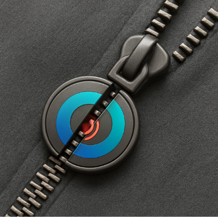

## Feedback on current page

In accessories: remove MagZip, ZipperBuddy. Mention instead: embedded accessories in your outfits that make them easier to put on or take off.

For suppliers: remove MagZip (B2B), replace with: we supply adaptive clothing accessories.

This will be the magnetic zipper we want to create and name it our own (could be Damj, which means to include or to join). But don't add that on the website, just keep it general (adaptive accessories).

## New general page

General statement:

Now we're building a website: <https://antami.ae/> but the current page will be a tab at the top among the menu, and we need a general 1st page with a general statement that talks about belonging and other things.

We need:

1. The general statement about belonging (don't make it just for people with disabilities, it's for everyone)
2. A 1st page that makes the person understand exactly what we do: one stop shop for people with disabilities, their families and anyone struggling to belong.
3. We will be having (need help organizing our ideas here): an AI tool for support on disabilities (could be for corporates or parents or people with disabilities), and an online platform with courses from professionals dedicated to disabled, service providers (medical staff, specialists, therapists...), governments entities, corporates...

I'm thinking to have a first page like:

**I am:**

- A person with disability
- A family member of a person with disability (under that: a sibling, a mother, a father)
- A service provider (a doctor, a nurse, a specialist...)
- A corporate (looking to employ a person with disability, disability etiquette, train an employee with a disability to get promoted to be a leader in the company, a shopping mall that wants to know how to have an inclusive environment, a museum that dedicates specific hours that are autism-friendly...)

Those explanations between brackets will be like a sub menu.

Eventually, we will be showing this project to a government entity, and we would like to have it adopted by the government and rely on us to serve the community and the disabled better to make the UAE excel in disabled rights and environment provided.

---

This is from Claude, shared exactly the text above and it gave me this (double click and it shows the link):

*[Embedded OLE object — original file: word/embeddings/oleObject1.bin, preview: word/media/image2.emf]*
